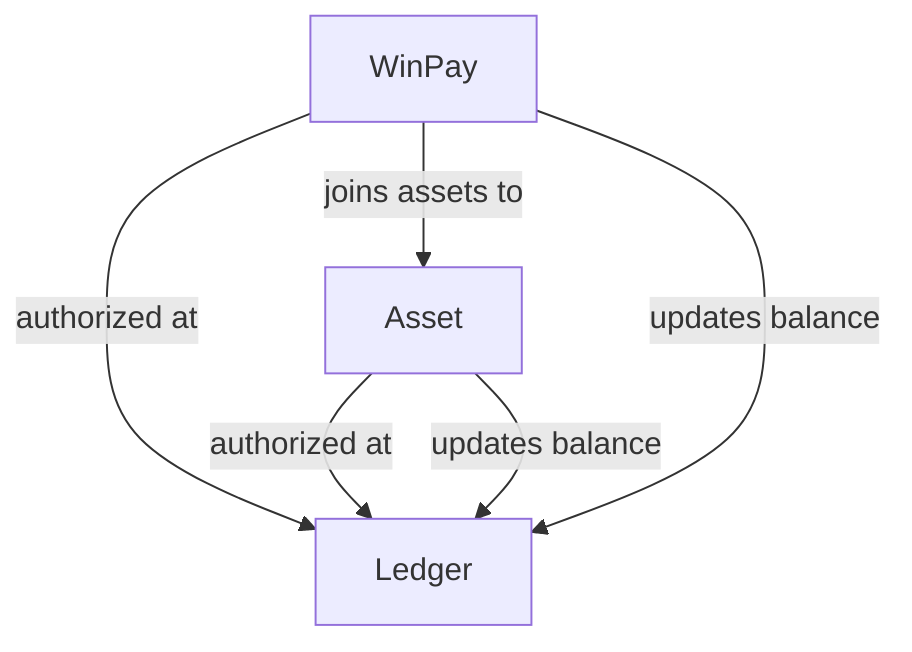

# WinPay

Win.so crypto payments manager contract

## Overview

The `WinPay` contract is dedicated to handling payments in stable coins for service.

To start accepting payments the service must be registered in the contract.

Every payment can be limited in time, so if your offer has expiration your payments will arrive in time or not at all.

Every payment will be linked to the unique service Id to make a reference between your off-chain accounting system and on-chain payment in crypto.

`WinPay` can handle payments supporting `permit` (EIP2612) feature.

For security sake balances and funds are separated in to different types of contracts. Balances are handled by the `Ledger` contract but funds sre handled by `Asset`-type of contracts. Every crypto asset supported by the `WinPay` must have its dedicated `Asset` instance. Every service provider can create his own `Asset` contract.

Assets in `WinPay` can be regular ERC20 tokens of `wrapped` ERC20 tokens. In the second case customers will be able to pay using native tokens (they are will be automatically `wrapped`).

## Contract architecture



## Use cases

### Making a deal

The `customer` wants to pay for the `service` using his tokens (stable coins or native tokens).

To make a deal he has to know:

- the provider Id (unique `bytes32` string)
- the service Id (unique `bytes32` string)
- the service offer expiration time (if this time will be reached but the deal will not be done the transaction will be reverted)
- address of the proper `Asset` contract
- the value of the asset (the service cost)

Optionally, if he wants to pay with tokens but won't to send `approval` transaction and the token supports EIP2612 the `customer` can generate `permit` signature and payment will be made automatically.

Using known information the `customer` should call one of two variants of the `deal` function (with and without `permit`).

### The deal refund

The service provider wants to refund funds paid by the customer.

To refund funds he has to know:

- the service Id (unique `bytes32` string)
- address of the proper `Asset` contract

Using known information the `provider` should call the `refund` function. If the deal associated with given service Id exists and other conditions are fulfilled the deal will be transferred to the `REFUNDED` state and funds will be returned to the `customer` account.

> ! Current version of the `WinPay` does not `unwrapping` wrapped funds during refunds and returns `wrapped` asset even if the `customer` made payment with native tokens.

## Test node

Local instances of contracts can be automatically deployed in the Hardhat environment using the following command:

```bash
yarn hardhat node
```

## Deployments

Staging environment: Sokol

- `Ledger`: 0x3196f354b7a95413E30889D1C6cE5074b10c43f5
- `WinPay`: 0x6f2fBD652A99Db4b8143c8383Ae39b5459268685
- `MockERC20`: 0x0462C345320C7Ed3071cd1426e6B62472C5bA96d
- `MockWERC20`: 0x63CD2DF580Df5509806A204090eDdCc6F3493Bf5
- `Asset (MockERC20)`: 0x1C375919362730AC69c5ACffeC775F11c9b75cF2
- `Asset (MockWERC20)`: 0x25149dE5afe2043C61687AD136527d2167EFC241
-
## Commits

To commit to the repository after staging the commit:

```bash
yarn commit
```

Select the appropriate type of commit message, any issues to close, and note any breaking
changes.

## Tests

Test are handled with `chai` and includes `solidity-coverage`, enabling coverage
reports to be done for the code-base. By default, contracts located in `contracts/test`
are ignored by `solidity-coverage`.

## Deployment

### Requirements

1. Ensure **100% solidity coverage** in tests prior to production deployment.
2. All `Ownable` contracts **MUST** have their owner set to the community multi-sig and/or
   `TimelockController`. **NO** contracts must be allowed to retain **ANY** deployer addresses
   in their configuration.
3. **MINIMUM** two reviewers prior to committing to the main branch.

### Scripts

This repository uses `hardhat-deploy` for reproducible deployment tests, as well as:

1. Get contracts via name from `ethers`.
2. Named accounts for more readable tests.
3. Conditional logic execution based on tagged network deploying to (allowing for more
   complex logic when deploying across multiple chains, and/or testnets).

Deployment scripts are contained within `deploy`, and these deployment scripts are executed
prior to any tests, and are executed in **alphabetical order**.

### How to use

Unit testing:

```
yarn test
```

Coverage analysis:

```
yarn hardhat coverage
```

Run deploy scripts and deploy to `mainnet`:

```
yarn hardhat deploy --network mainnet
```

Now verify the contracts on Etherscan:

```
yarn hardhat --network mainnet etherscan-verify
```

**NOTE: Substitute `mainnet` above for the applicable target network.**

### Scripts

#### Registering a service provider

```bash
yarn hardhat --network sokol registerProvider --owner 0x2aAe83D2e734fA7A586C1C981175DFAb551fb512 --address 0x6f2fBD652A99Db4b8143c8383Ae39b5459268685 --provider win_win_provider

> Provider registration tx:  0x4d6933e2097acc6be2ae38e9552876a733865e0602d19501371609aecda572ab
> Provider 0x394e5c06a83eeea7fd8e0e50bb1ff1f13bec1a4e353a9a0f6db9dea030bcbef3 has been registered successfully
           ^^^
           providerId
```

### Minting of test tokens

```bash
yarn hardhat --network sokol mintTest --owner 0x2aAe83D2e734fA7A586C1C981175DFAb551fb512 --address 0x0462C345320C7Ed3071cd1426e6B62472C5bA96d --to 0xA0B74BFE28223c9e08d6DBFa74B5bf4Da763f959 --amount 1000000000000000000000000

> Minting tx:  0xcc5eafdf3de6b77e3d133f8320bf44fa31c9d57aae050949c9023fd93048ab30
> 1000000000000000000000000 has been minted to 0xA0B74BFE28223c9e08d6DBFa74B5bf4Da763f959 successfully
```
